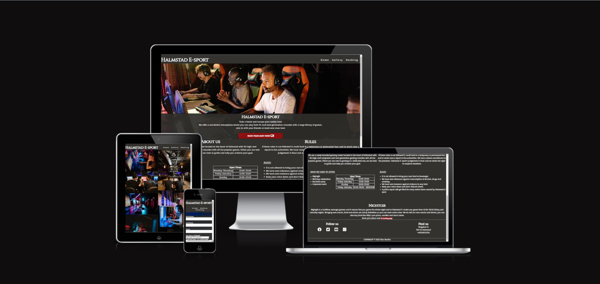
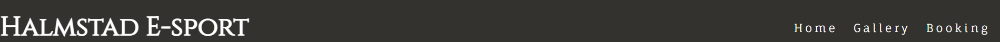
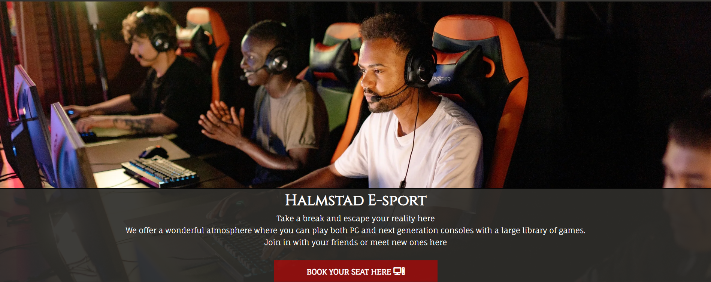
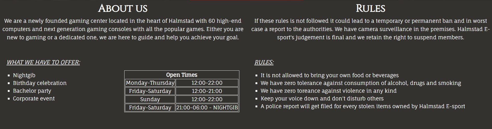
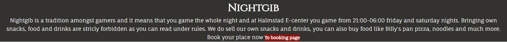
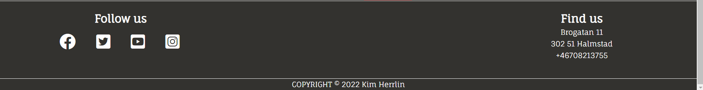
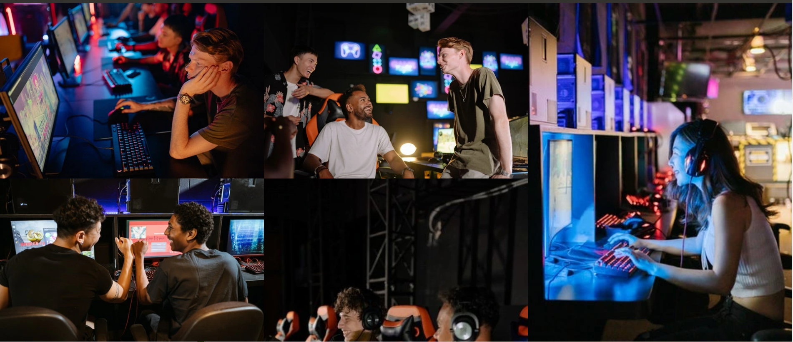
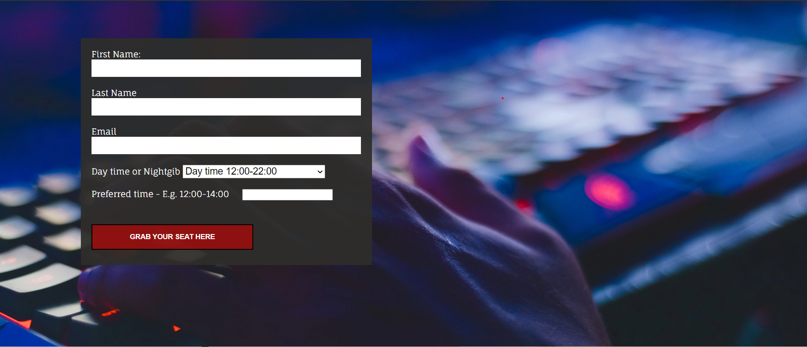

# Halmstad E-sport
[Live link to Halmstad E-sport](https://herrlin85.github.io/Halmstad-E-sport/)

Halmstad E-sport is a site where people can find information about open times, rules to follow while here and even book time at the gaming center located in the middle of the city in Halmstad, Sweden. The site is responsive and work for a range of devices.

## Features

 - **Navigation Bar**
     - Navigation bar is implemented in every page, it includes links to Home page, Gallery and Booking page and it's fully responsive
    - This section makes it easy for users to navigate on every device 
    - The logo "Halmstad E-sport" is a link that takes the user to the main page

 - **The landing page**
     - Includes a photo and a text with information introducing what the site is about and what you can expect while visiting
     - This section inckludes a very visible link to the booking page which makes it even easier for the user to get too the booking page

 - **About section**
     - Left side shows information about devices, open times and different events such as Nightgib, birthday celebrations, Bachelor parties and cororate events.
     - Right side of the section tells the user what rules that apply when they are visiting such as no alcohol, drugs or smoking is allowed

 - **Nightgib section**
     - This section explains what nightgib is and information about food and drinks while attending a nightgib
     - This information is also very useful for parents to kids that want to attend this event since it clearly state what time the event is

 - **The Footer**
     - The left side of the footer includes a Follow us section with links to social media that opens up in a new tab, the social media links is very useful so the user can follow Halmstad E-sport on Facebook, Twitter, Instagram and Youtube
     - The right side of the footer includes a Find us section with adress and phone number which is very important for users if they need to get in contact with gaming center
     - The middle bottom part shows the copyright

 - **The Gallery page**
    - This page shows a collection of photos of people gaming and having fun
    - The gallery is especially useful for users who want to get an idea how it look inside Halmstad E-sport with computers, desks, gaming chairs and gaming consoles

 - **The Booking page**
    - This page will allow the user to book a time when they can play
    - The booking gives the option to either book day time or for a nightgib which is very useful if the user wants to know if there is any available time
    - The user will have to type in their first name, last name and email adress in order to submit 

